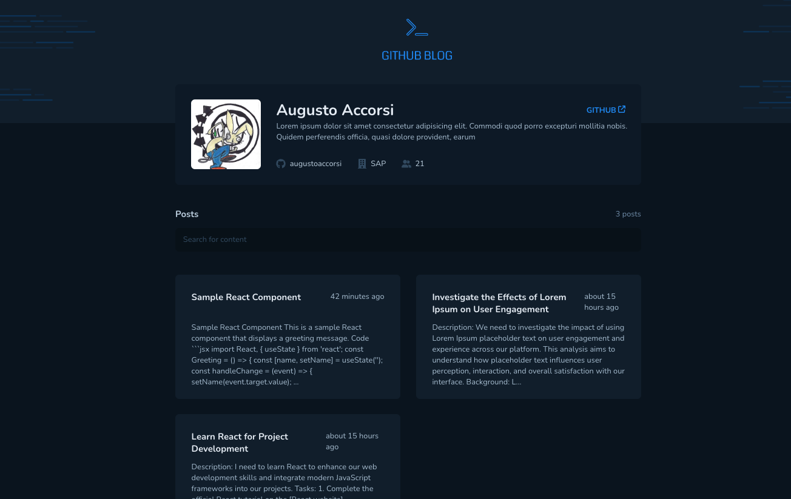
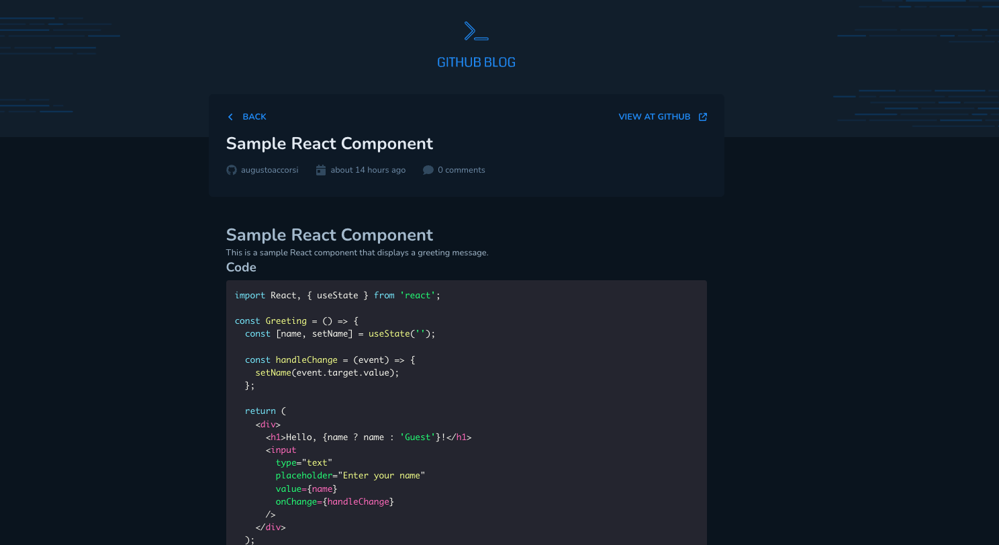

# GitHub Issues Blog Project

This project is a GitHub blog application that retrieves data from GitHub issues of the current repository. It is built using React and JavaScript and uses the GitHub API to fetch user and issue data.

## Screens

## Features

-   **Fetch User Data**: Retrieve and display GitHub user information.
-   **Fetch Issues**: Retrieve and display issues from the current repository.
-   **Blog Posts**: Use GitHub issues as blog posts.
-   **Responsive Design**: Ensure the blog is accessible on various devices.

## Technologies Used

-   **React**: For building the user interface.
-   **JavaScript**: For application logic.
-   **GitHub API**: For fetching user and issue data.
